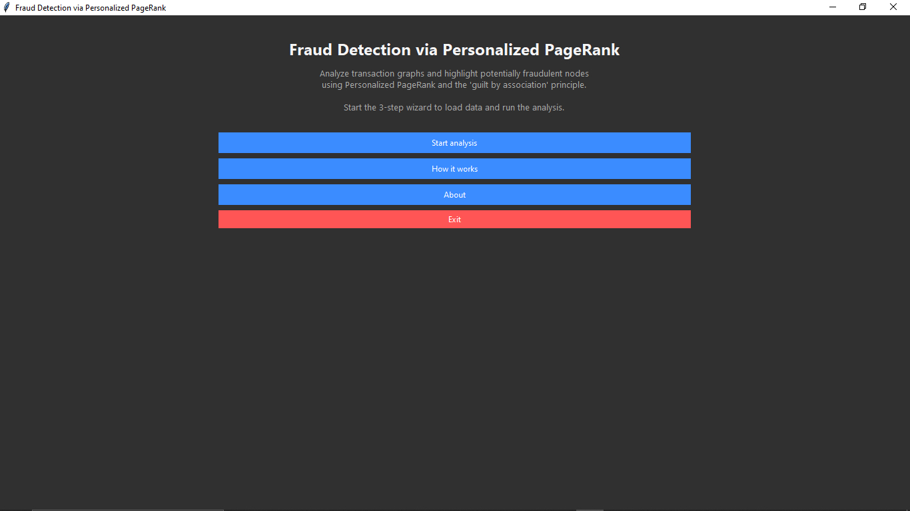
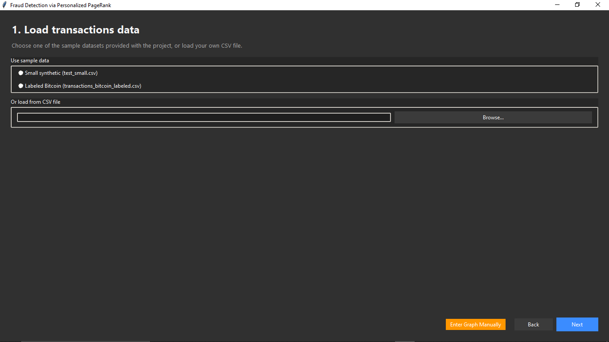
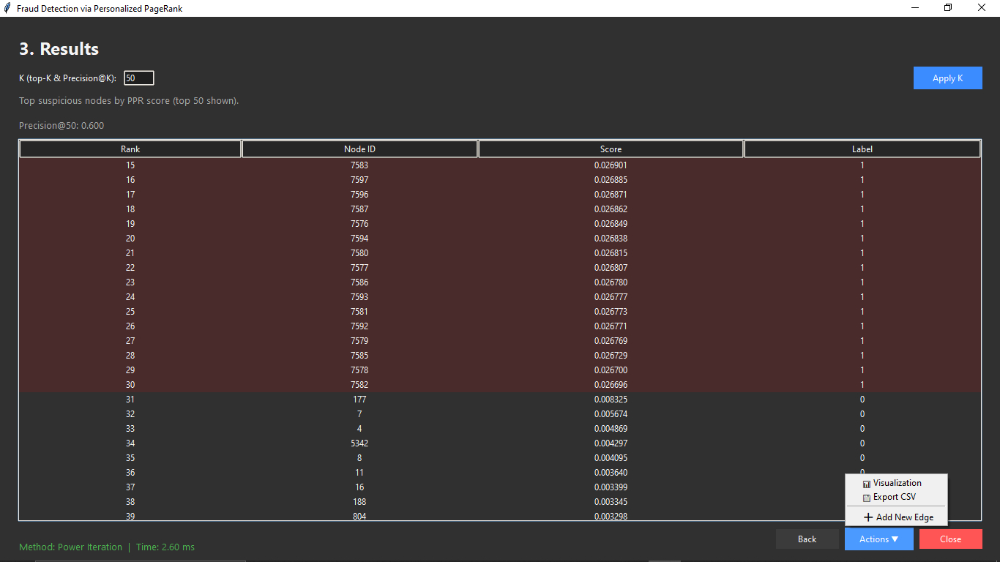
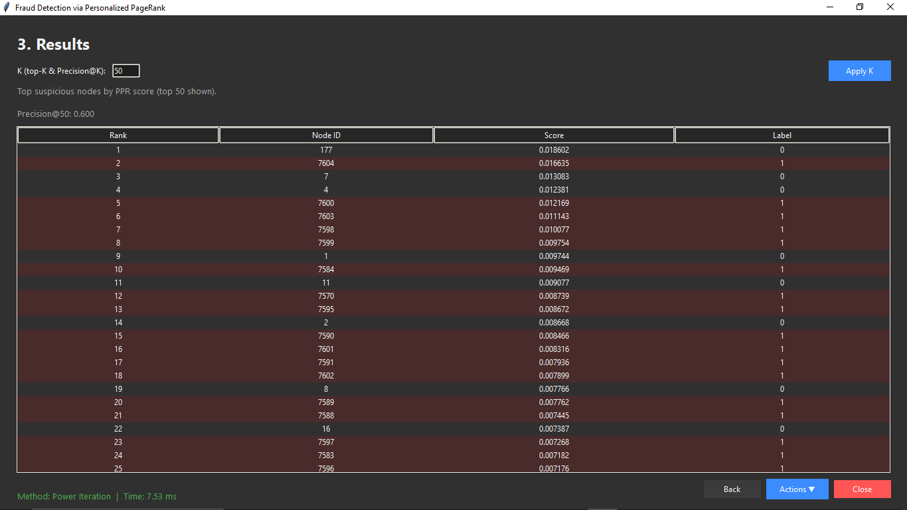

# 🕵️‍♂️ Fraud Detection via Personalized PageRank


> **University:** Shahid Beheshti University (SBU)  
> **Course:** Data Structures & Algorithms  
> **Instructor:** Dr. Katanforoush  
> **Semester:** Fall 2025  

---

## 📖 Project Overview

This project implements a scalable **Fraud Detection System** based on Graph Analysis techniques. It utilizes the **Personalized PageRank (PPR)** algorithm to identify suspicious entities in a transaction network using the *"Guilt by Association"* principle.

The system propagates a "suspicion score" from a set of known fraudsters (Seed Set) to other nodes in the graph. Nodes that have strong or frequent connections to the seeds receive higher suspicion scores.

### 🌟 Key Features
* **User-Friendly GUI:** A complete Tkinter-based wizard for loading data, configuring parameters, and viewing results.
* **Optimized Performance:** Uses **Sparse Matrices (CSR)** to handle large-scale graphs with $O(V+E)$ complexity.
* **Robust Math:** Implements **Power Iteration** with rigorous handling of *Dangling Nodes* (Dead Ends) and *Teleportation vectors*.
* **Real-time Metrics:** Displays execution time (ms) and **Precision@K** accuracy.
* **Dual Algorithms:** Includes both **Power Iteration** (Exact) and **Monte Carlo** (Approximation).

---

## ⚙️ Technical Architecture

### 1. The Algorithm (PPR)
The core engine solves the Personalized PageRank equation iteratively:

$$r^{(t+1)} = (1-\alpha) \cdot r^{(t)}M + \alpha \cdot p$$

Where:
* **$M$**: The transition matrix (Row-Normalized).
* **$p$**: The personalization vector (non-zero only for seeds).
* **$\alpha$**: The damping factor (probability of teleporting back to seeds).

### 2. Data Representation
To ensure scalability, we do **not** use dense matrices. Instead, we utilize the **Compressed Sparse Row (CSR)** format.
* **Why?** Real-world transaction graphs are extremely sparse.
* **Benefit:** Reduces memory usage from $O(N^2)$ to $O(N + E)$ and speeds up matrix-vector multiplication.

### 3. Convergence Criteria
The algorithm stops when the rank vector stabilizes, defined by the L1 Norm error:
$$||r^{(t+1)} - r^{(t)}||_1 < \epsilon$$

---

## 📂 Project Structure

```text
fraud-detection-ppr/
│
├── data/                   # Dataset files (CSV, MTX support)
│   ├── transactions.csv
│   └── socfb-Caltech36.mtx
│
├── src/                    # Source Code
│   ├── algorithms/         # Core Logic
│   │   ├── ppr_power.py    # Power Iteration Implementation
│   │   └── ppr_monte.py    # Monte Carlo Implementation
│   ├── gui/                # UI Components (Tkinter)
│   │   ├── pages/          # Wizard Pages (Welcome, Load, Results...)
│   │   └── app.py          # Main Application Controller
│   └── utils/              # Graph Parsers & Matrix Helpers
│
├── results/                # Generated plots and logs
├── requirements.txt        # Python dependencies
└── main.py                 # Entry point
```
---

## 🚀 Installation & Usage

### Prerequisites
Ensure you have Python 3.10+ installed

### ​1. Clone the Repository
```bash
git clone https://github.com/your-username/fraud-detection-ppr.git
cd fraud-detection-ppr
```

### 2. Install Dependencies
```bash
pip install -r requirements.txt
```

### ​3. Run the Application
```bash
python src/main.py
```

## 📊 How to Use the GUI Wizard
### ​Welcome Page: 
Click "Start Analysis".
<p align="center">
  
</p>

### ​Load Transactions:
##### Support for .csv (Source, Target) and .mtx formats.
​Use the provided socfb-Caltech36.mtx or test_small.csv for testing.
<p align="center">
  
</p>

### ​Define Seeds:
#### manual:
Enter IDs of known fraudsters.
#### ​Random: 
Let the system pick random nodes for testing purposes.
### ​Configure Parameters:
##### Set α (Damping Factor, usually 0.85).
##### ​Set ε (Tolerance, e.g., 1e-6).
<p align="center">
  
</p>

### ​Run: 
Click "Start Analysis".
### ​Analyze Results:
##### View the top suspicious nodes in the table.
##### ​Check the Execution Time (ms) at the bottom left.
##### ​Review Precision@K if labels are available.
<p align="center">
  
</p>
<p align="center">
  
</p>

## ​⚠️ Limitations & Future Work
#### Cold Start Problem:
New nodes with no transaction history cannot be scored accurately as the algorithm relies purely on link analysis.

#### Dynamic Updates:
The current system uses an incremental update approach for new edges, but a full re-computation is recommended periodically to reset accumulated error drift.

## ​👨‍💻Author
### Developed by:
#### Shahriyar Moqimi and Ali Shameli
​Submitted as the final project for the Data Structures course, Shahid Beheshti University.
